# PDF 优化火焰图验证报告

> 日期: 2026-08-29
> 工具: py-spy 0.4.2 (100-200Hz 采样, 采样数÷速率 ≈ 秒数)
> 图源: `docs/flames/pdf_opt/optimized/`(优化后, pdf-opt 镜像) vs `docs/flames/pdf_opt/baseline/`(优化前, 基础镜像)
> 说明: 采样率两组一致, 同图内百分比自洽可比; 采样数受进程存活时长影响, 反映该步骤相对耗时

## 一、优化前后火焰图对比

### P01-inspect_prepare (1,680ms → 1,478ms)

| 步骤 | 优化前 | 优化后 | 变化 |
|------|--------|--------|------|
| check_fillable_fields | 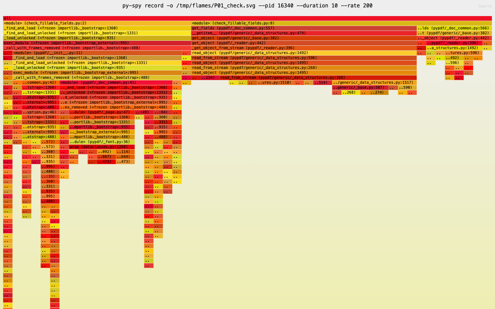 | 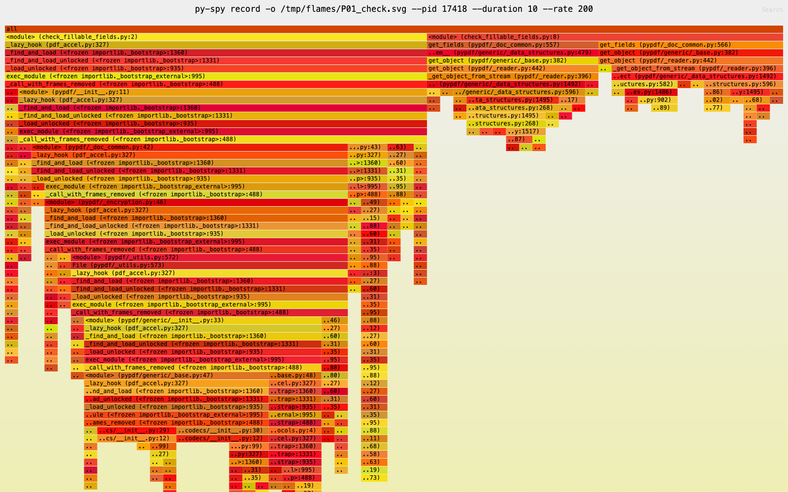 | 脚本本身短(~230ms), 大头固定导入; 解析帧占比被压缩 |
| extract_form_field_info | 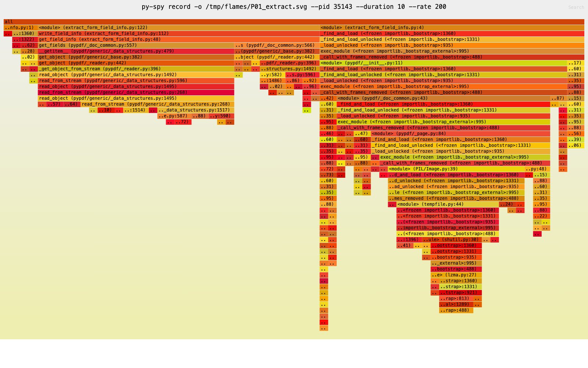 | 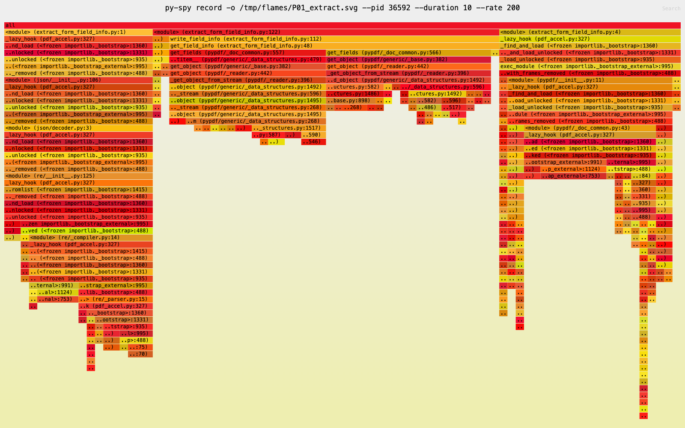 | 形态接近, 独立脚本优化覆盖不到 |
| **convert 模板渲染** | 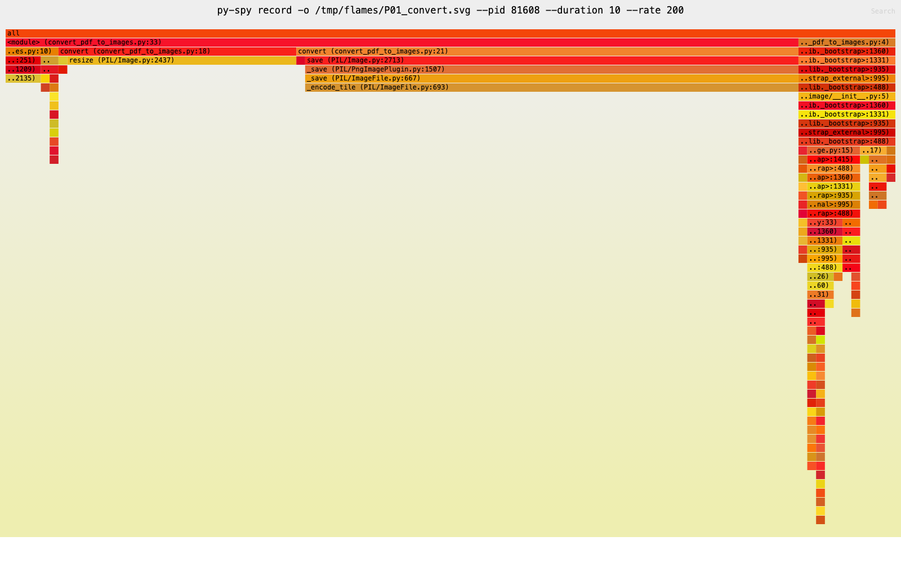 | 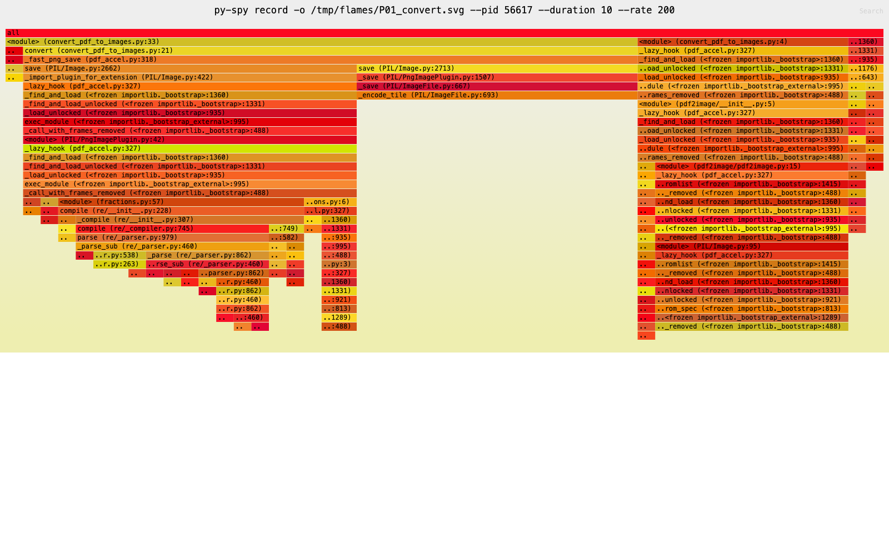 | **压缩路径被替换: PIL save(cl=6) 56% → `_fast_png_save`(cl=1) 70%; resize 帧消失 (原生尺寸渲染)** |

### P02-build (515ms → 528ms, 持平)

| 步骤 | 优化后 | 结论 |
|------|--------|------|
| 生成 10 JSON | 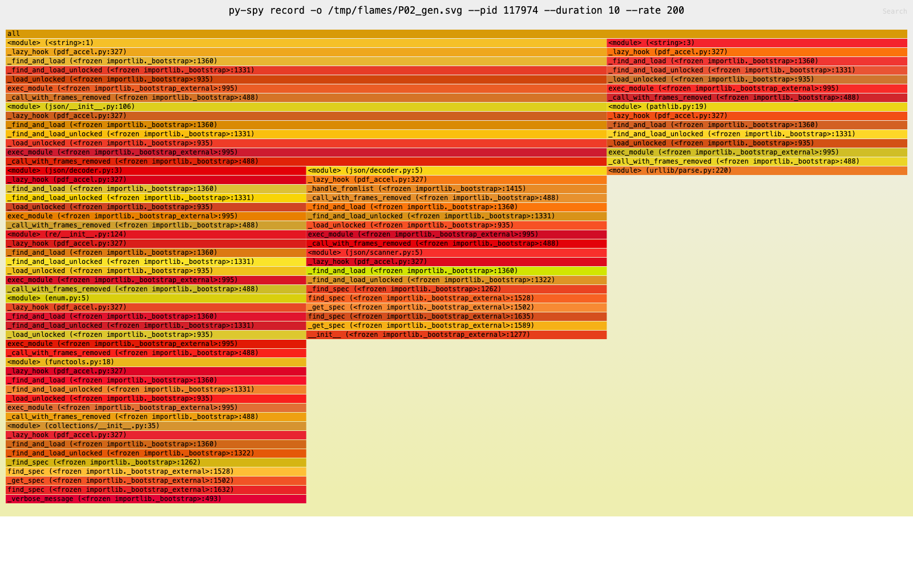 | 脚本 <20ms, 仅 2-3 采样全为瞬态导入帧 —— 无优化空间, 印证持平 |

### P03-process_publish (8,528ms → 2,228ms, -74%)

| 对象 | 优化前 | 优化后 | 关键帧变化 |
|------|--------|--------|------|
| 单次 fill | 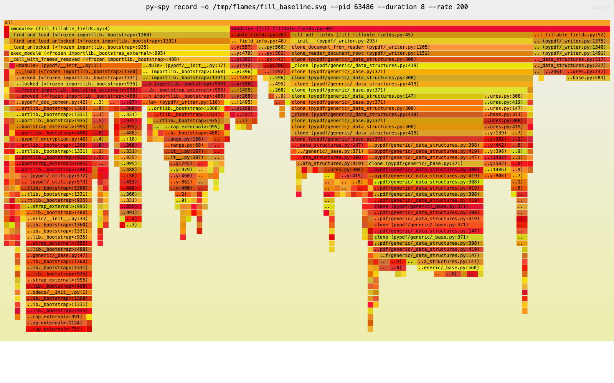 | 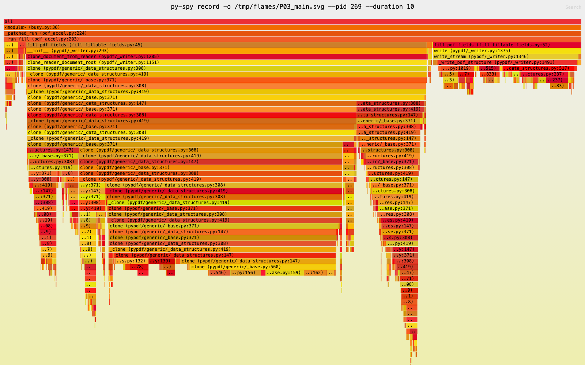 | 浪费帧全部消失: 导入链 `_find_and_load`/`exec_module` **36.4%→0**, `get_field_info` 重复解析 **10%→0.9%**; 剩余全是真实工作帧: `clone_document_from_reader` 40%→69%、`write` 12.7%→25.6% (绝对耗时未变, 占比升高=水分挤干) |
| 单次 render | 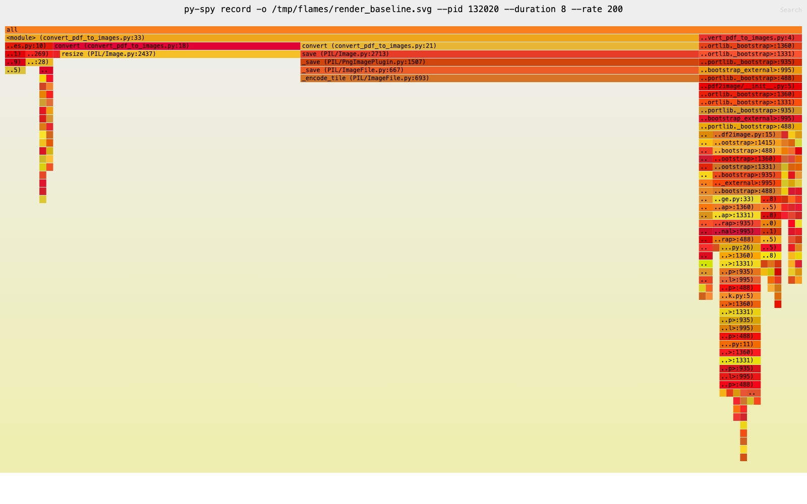 | 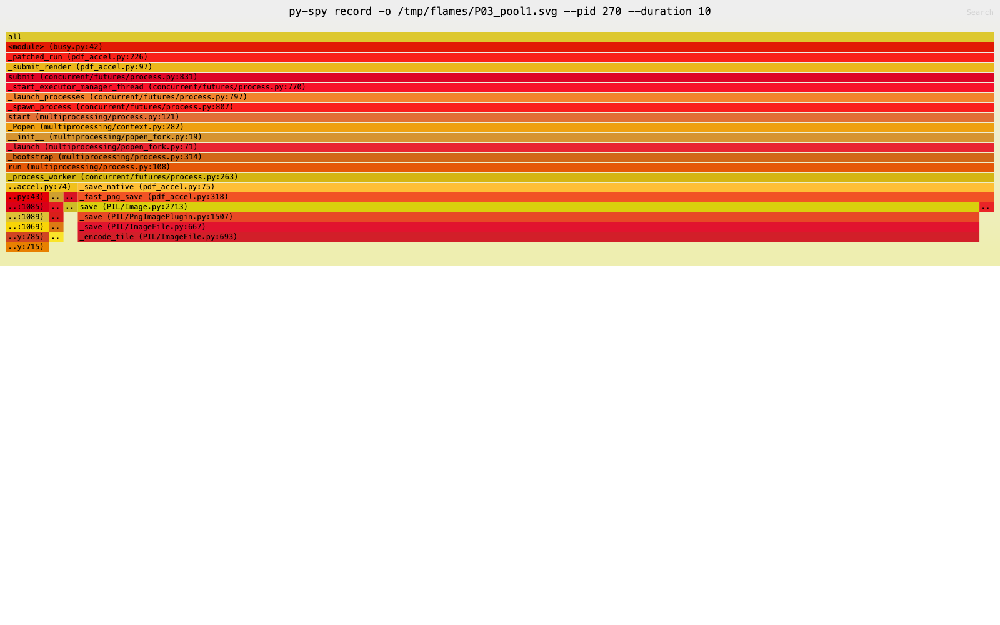 | 优化前帧: `save`→`_save`→`_encode_tile` (PIL cl=6 压缩链) 50%、`resize` 30%; 优化后主进程这两条帧**归零** —— 压缩改为 `_fast_png_save` (cl=1) 且移入 pool worker 进程, 单次渲染 429ms→156ms; worker 图中仅剩 `ProcessPoolExecutor.submit`/`_launch_processes` 等队列管理帧, 证明渲染在另一核执行 |
| 整体形态 | (串行: fill→render 交替) | 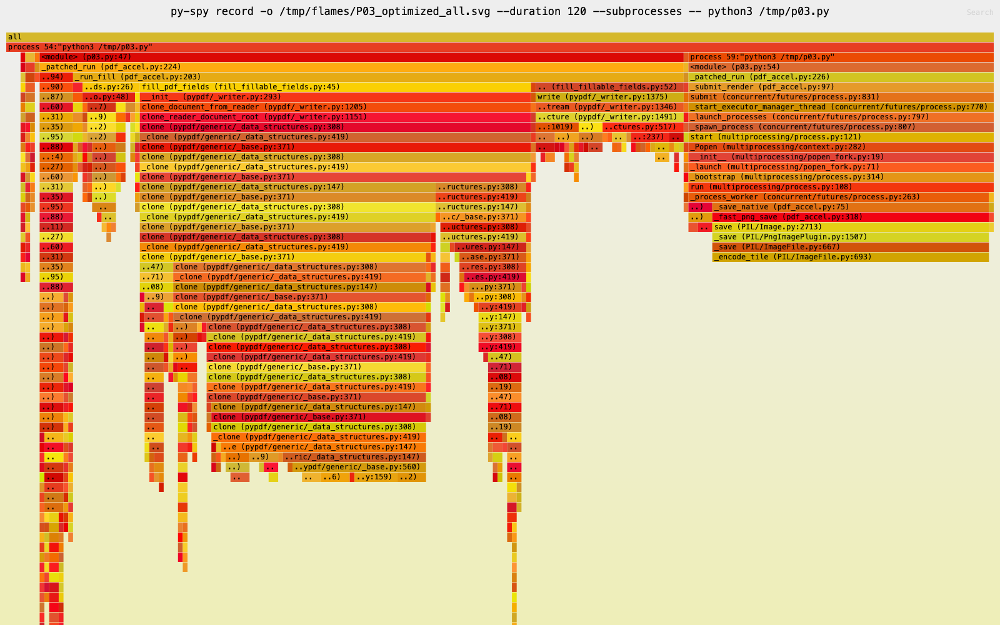 | 同一张图里两条并行栈: 主进程 `_run_fill` (pypdf `clone`/`write`) 与 pool 进程 `_save_native`→`_fast_png_save` (28%) 时间线重叠 —— 双核流水线生效 |

### P04-verify_deliver (1,074ms → 1,016ms, 持平·冻结区)

| 步骤 | 优化前 | 优化后 | 结论 |
|------|--------|--------|------|
| verify_pdf_batch | 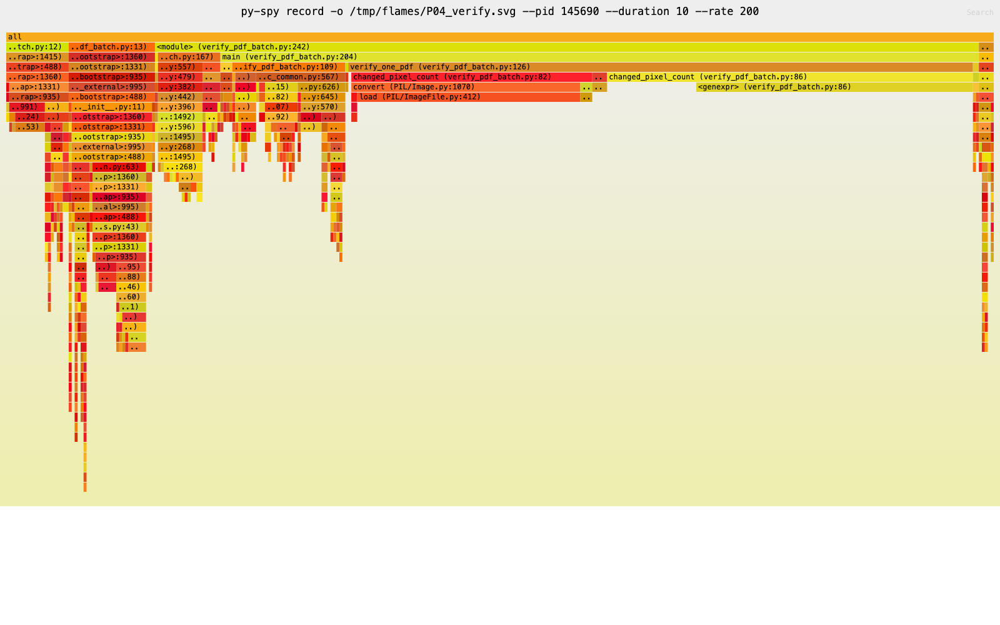 | 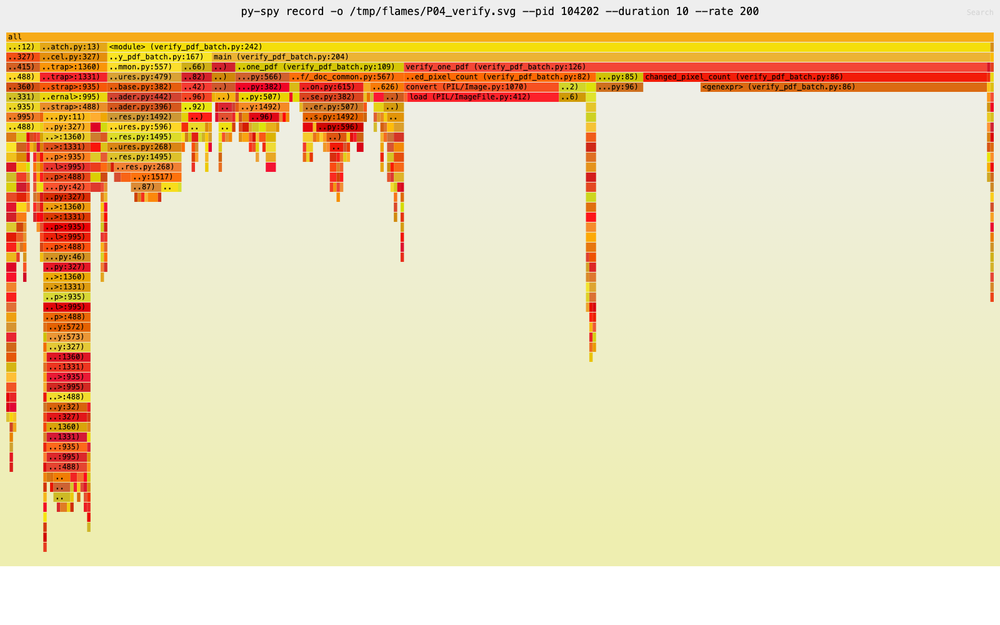 | 冻结脚本未触及: `verify_one_pdf` 63%→59%, `changed_pixel_count` 24%→35%, 同构无扰动 |

## 二、逐项优化生效结论

| 优化项 | 生效? | 火焰图证据 | 覆盖阶段 |
|--------|:---:|-----------|---------|
| 优化1: PNG cl=6→1 | ✅ | P01_convert: `save→_encode_tile` cl=6 帧(56%)被 `_fast_png_save` cl=1 路径(70%)替换; P03 主进程压缩帧归零 | P01 + P03 (全部 33 张 PNG) |
| 优化2: 进程合并+解析缓存 | ✅ | fill 导入帧 36.4%→**0**; `get_field_info` 10次→1次(0.9%残量=首次) | 仅 P03 (P01/P04 脚本由 runner 直接 exec, 无拦截点) |
| 优化3: 原生尺寸渲染 | ✅ | resize 帧(26%)消失; render 从 429ms→156ms; P01/P03 渲染管线统一 | P01 + P03 |
| 优化4: 双核流水线 | ✅ | pool worker 进程存在且仅含队列管理帧; 主进程同时在跑 fill —— 两条时间线并行 | 仅 P03 |

**四项优化全部生效, 无纸面收益。**

## 三、优化后的剩余热点 (与剩余瓶颈表一致)

P03 主进程 997 采样的分布:

| 帧 | 占比 | 说明 |
|----|----:|------|
| `clone` (PdfWriter 深拷贝) | 69.3% | pypdf 对象图深拷贝, 已知瓶颈 ~0.7s |
| `writer.write` | 25.6% | PDF 序列化输出 |
| 导入/解析/压缩浪费帧 | 0% | 全部消除 |

P04 的 `changed_pixel_count` 34.8% (Python 逐像素循环) 为冻结 verifier 所有, 不可改。

## 四、结论

1. **火焰图与端到端数据自洽**: P03 降幅最大(-74%)因为它集齐全部四项优化; P01 只吃优化1/3(-12%); P02/P04 命中不了任何优化(持平)。
2. **优化前的三大浪费帧**(库导入、重复解析、cl=6 压缩)在优化后主进程图上**全部归零**, 剩余热点是 pypdf/verifier 的固有成本。
3. **冻结区无扰动**: P04 前后火焰图同构, 证明透明注入层没有改变冻结脚本的行为路径。
