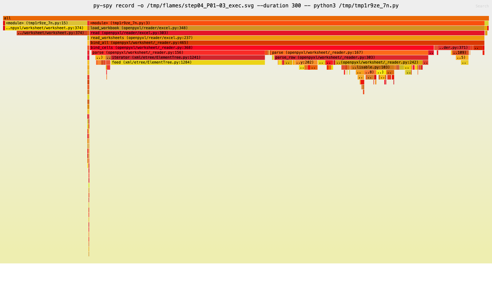
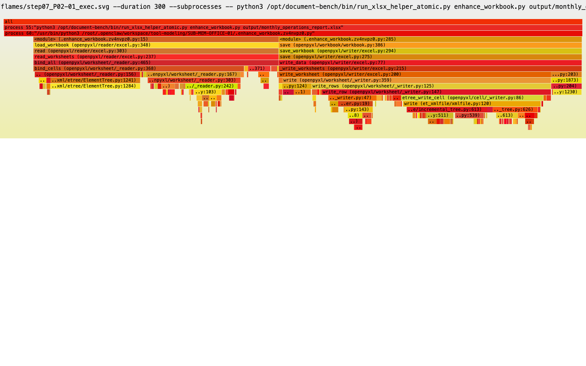
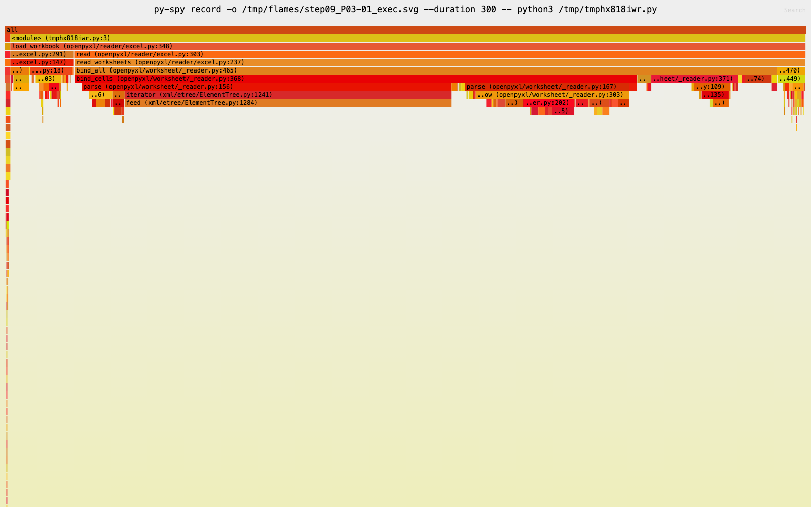
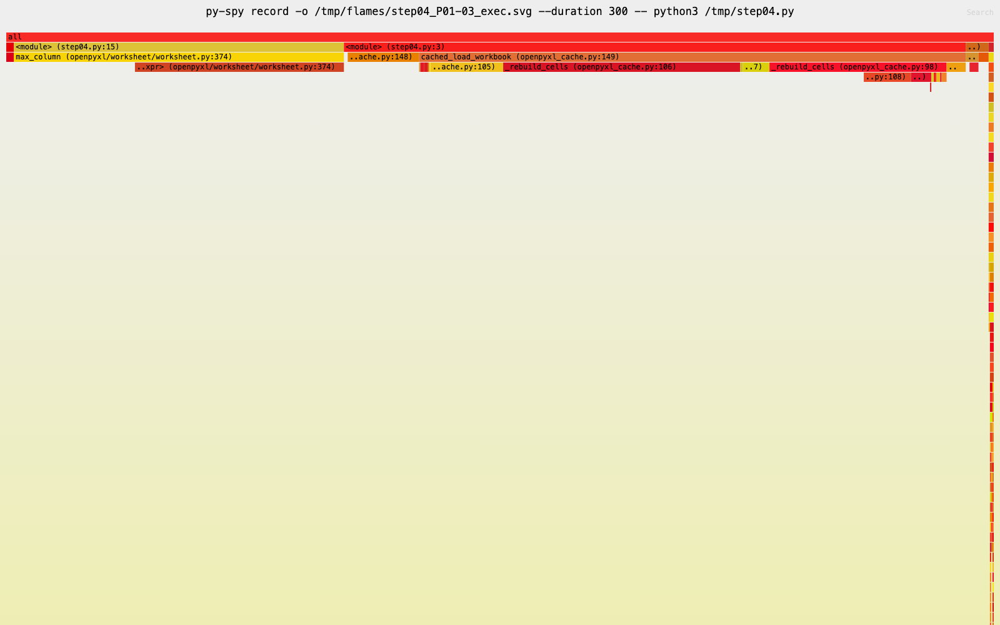
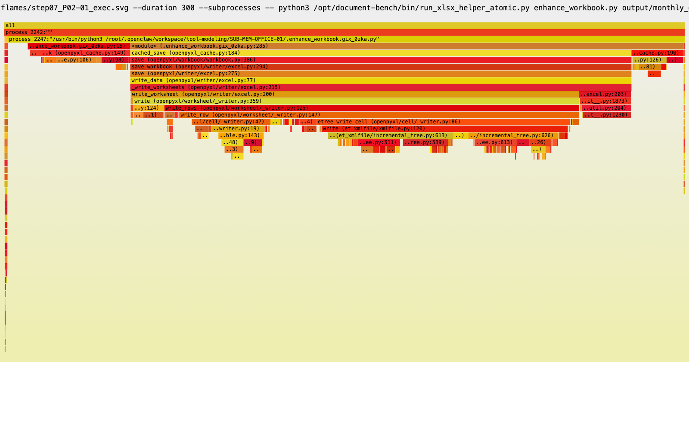
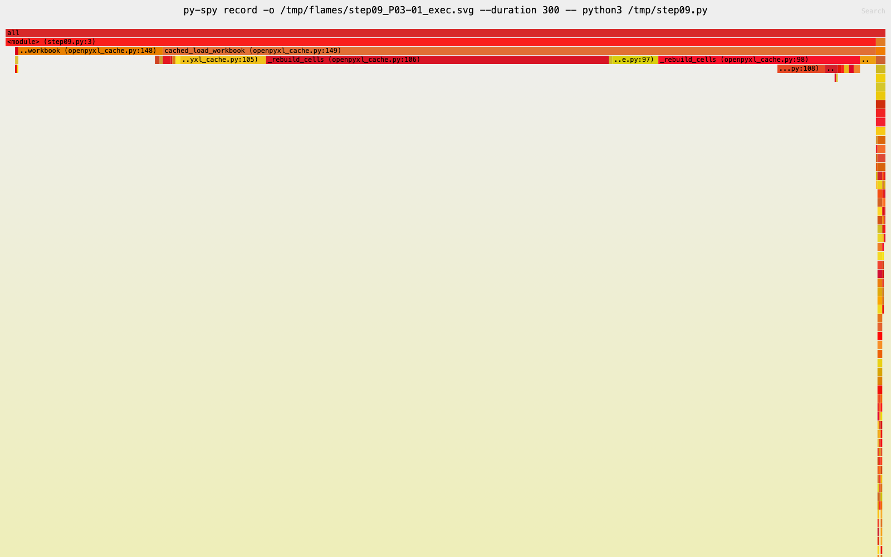

# XLSX 文档基准优化汇报（全三轮）

> 日期: 2026-08-29 ｜ 场景: 2核4G docker 容器, XLSX 文档基准, recipe 15 次工具调用一字不动
> 总结论: **单任务 259s → 70.2s (-72.9%), 业务校验 100% 通过, 逐格内容与官方 openpyxl 完全一致**

## 一、总览

| 轮次 | 思路 | 耗时 | 降幅 |
|------|------|----:|----:|
| 基线 | 无任何优化 | 259s | — |
| 第一轮: 磁盘缓存 | 同一文件反复解析 → 只解析一次, 之后从快照重建 | 174.9s | -33% |
| 第二轮: 解释器层 | 每个单元格一套 Python 对象协议的"固定税"逐项砍掉 | 116.6s | -33% |
| 第三轮: 大表懒物化 | 250 万格的大表根本没人读 → 干脆不建对象 | **70.2s** | -40% |

三轮叠加, 同一窗口内能完成的任务数从 2 个涨到 4 个。

## 二、问题定位

### 2.1 钱花在哪: 15 次调用的实测账单

对 15 次工具调用逐一计时, 发现总账几乎全部花在两处:

| 类别 | 耗时 | 占比 |
|------|----:|----:|
| openpyxl 全量加载(7 次) | 192.7s | 74.8% |
| LibreOffice 公式重算(1 次) | 62.6s | 24.3% |
| 其余 I/O | ~2.2s | 0.9% |

同一份 123.5MB / 12.3 万行的工作簿被完整加载 7 次, 每次都是独立进程、从零解析。而流式只读模式读同一份文件只要 1.7s——证明慢的不是"读文件", 而是把整张表变成 Python 对象树。

### 2.2 为什么慢: CPU 画像

| 指标 | 表现 | 含义 |
|------|------:|------|
| 指令数 | ~190B | 真正的问题: 指令数太多 |
| IPC | ~2.50 | CPU 执行效率不差 |
| syscall | ~0.07% | 不是 I/O 瓶颈 |
| libpython 占比 | ~87% | 解释器是第一瓶颈 |
| libexpat 占比 | ~6.5% | XML 解析器不是大头 |

即: **鲲鹏 CPU 不是跑不动 openpyxl, 而是 openpyxl 让它执行了约 1900 亿条 CPython 指令**。这决定了后续方向——不是调 NUMA/SVE/内存带宽(它们只优化"每条指令跑多快"), 而是让 CPU 少执行指令。

### 2.3 优化前火焰图: XML 解析 + 对象构造主导

以三个代表性步骤为例(左: 基线; 全部 9 张见 `docs/flames/png/xlsx_steps/`):

| 步骤 | 内容 | 基线火焰图 |
|------|------|-----------|
| TP-04 | 检查工作簿结构 |  |
| TP-07 | 增强(读+写) |  |
| TP-09 | 读公式 |  |

所有全量加载步骤的热点形态一致: XML 解析(expat 逐字符 + Python 装配)占 70~80%, 在 6 个步骤里重复出现。

## 三、第一轮: 磁盘缓存 —— 同一文件只解析一次

**背景。** 7 次加载里有大量重复: 4 次加载同一份"重算后"文件; 模板与其副本内容相同; 增强后的版本被再次读取。每次重复都在为同一份 XML 付全额解析费。

**方法。** 在容器内透明注入一个缓存层(镜像加一个钩子文件, recipe 命令零改动): 第一次加载某文件时照常解析, 顺手把结果(清空单元格后的"壳子" + 一张 250 万行的紧凑数据表)存进磁盘缓存; 再次加载同一文件时跳过全部 XML 解析, 直接从快照重建对象。缓存键用文件内容指纹(首尾 4MB md5 + 大小), 同内容不同路径共享、文件一被改写自动失效, 不依赖时间戳。任何存快照的失败都降级为未缓存, 不阻断业务。

**收益。** 6 次命中各省 14~20s, 单任务 **259s → 174.9s (-33%)**。火焰图上 XML 解析帧整块消失:

| 步骤 | 优化后火焰图 | 热点变化 |
|------|-------------|----------|
| TP-04 |  | 解析 72% → 快照重建 63% |
| TP-07 |  | 读侧解析消失, 写序列化成为新热点 |
| TP-09 |  | 解析 73% → 快照重建 81% |

**边界(火焰图同时暴露的)。** 缓存救不了三种场合: ① 每次真正的冷解析(重算后文件的"头两次读取"); ② 存盘——TP-07 命中后第一热点变成写序列化; ③ LibreOffice 重算本身。这三块就是后两轮的靶子。

## 四、第二轮: 解释器层 —— 砍掉每个单元格的"固定税"

**背景。** 缓存消灭了"重复解析", 但每次解析、每次命中重建、每次存盘, 仍按"每个单元格一套 Python 对象协议"执行——构造函数做一轮已知道答案的默认初始化、每格复制一份只读的样式数组、垃圾回收器周期性把几百万个存活对象扫一遍却几乎收不到垃圾。250 万格 × 每格几条解释器指令, 就是几十亿条指令。

**方法与收益(四项, 均可运行时开关单独归因)。**

1. **解析期间关闭垃圾回收。** 在"完整解析""命中重建""缓存提取"三个阶段临时关闭循环垃圾回收, 结束恢复。堆在单调增长、几乎没有垃圾循环, 周期性扫描是纯浪费。单次完整解析 **-3.9s**。
2. **单元格跳过构造函数。** 两条路径(缓存命中重建 + openpyxl 自己的装配)都改为"直接构造 + 槽位直填", 样式改为共享样式表条目不再逐格复制; 带版本与源码特征校验, 不匹配自动退回原生路径。单次完整解析再 **-3.9s**(两项叠加 25.2s → 18.8s); 命中重建 **~5s → 2.15s**。
3. **删除存盘后的无效缓存填充。** 第一轮在存盘后也顺手填缓存; 重新核对流程后发现, 唯一一次 openpyxl 存盘的产物马上被 LibreOffice 重算整文件改写, 刚填的缓存指纹立刻失效——**永远无人命中**, 每次白付几秒。撤掉该路径, **-2~3s**。
4. **存盘改走 lxml 序列化。** 此前实验证明"lxml 读 worksheet 慢 59%", 但那只是读。openpyxl 的写路径独立一套: 装了 lxml 自动切换, 且读路径在源码层面不受影响。镜像离线安装 lxml 后全量存盘 **24.98s → 22.67s (-9.3%)**。

**收益汇总。** 同日同机 A/B: **160.7s → 116.6s (-27.5%)**, Success 100%, 复跑 117.0s。对基线累计 -55%。

**归因矩阵(单次完整加载, 开关逐一关闭):**

| 配置 | 耗时 | 单项收益 |
|------|----:|----:|
| 两项解释器优化全关 | 25.24s | — |
| 只关垃圾回收优化 | 21.36s | 构造优化 -3.9s |
| 只关构造优化 | 21.35s | 垃圾回收优化 -3.9s |
| 两者全开 | **18.78s** | 合计 -6.5s |

## 五、第三轮: 大表懒物化 —— 250 万个对象根本不用建

**背景。** 第二轮结束时的剩余大头全部压在"必须真解析"的场合: TP-07 存盘 22.7s(250 万格重新 XML 序列化+压缩)、TP-08 重算后首次双读 ~39s、TP-04 冷解析 ~25s——全部在为 Raw_Sample 这张 12.3 万行大表付钱。而核查全部 15 次调用后发现: **没有任何一次真正读过大表的数据区**(结构检查只看行列数和表头, 校验脚本显式跳过大表, 增强脚本只改小表)。既然没人读, 就不该建这 250 万个对象。

**方法(三件套)。**

1. **加载: 字节级体检, 合格就跳过。** 加载时把大表 XML 整块读出(解压仅 0.17s), 用 C 速度的字节扫描做"体检": 只有数值/文本格(无公式、错误值、布尔、日期型)、每格结构完整、无转义与富文本, 且维度声明齐全 → 只解析表的头部+尾部(视图、列宽、筛选、边距等全部保留), 表体字节原样留存, 顺带物化第 1 行表头。LibreOffice 重算后的"共享字符串"形态同样放行。不合格 → 原生完整解析, 行为与官方完全一致。
2. **访问: 元数据即时答, 真访问才物化。** 行数列数从体检结果即时返回; 读表头零成本; 一旦真碰到数据区, 触发快速物化(字节级一次提取 + 直填槽位, 日期等值转换逐条复刻官方逻辑), 任何意外自动回退官方解析器兜底正确。
3. **存盘: 原始字节直通。** 增强脚本只改了小表, 大表从头到尾没被碰过——存盘时直接把它的原始压缩字节搬进新文件, 不再走"250 万对象 → XML → 压缩"流水线。共享字符串形态不满足直通条件, 保守回退正常写。

缓存同步协同: 大表在快照里只存一个"懒标记", 快照从 58MB 缩到 MB 级。

**收益。**

| 关键单点 | 官方 | 第三轮 |
|----------|----:|----:|
| 大表冷加载 | 22.2s | **0.96s** |
| 重算形态加载(共享字符串) | 18.2s | **2.1s** |
| 全簿存盘(含大表) | 22.9s | **0.53s** |
| 缓存命中 | — | **0.90s** |
| 真访问时的物化(保底正确代价) | — | 6.5s |

单任务 **116.6s → 70.2s (-39.8%)**, Success 100%, 复跑 70.2s。

## 六、逐调用全景(基线 → 三轮)

| 调用 | 内容 | 基线 | 一轮 | 二轮 | 三轮 | 三轮的机制 |
|------|------|----:|----:|----:|----:|-----------|
| TP-04 | 结构检查 | 29.7 | 33.0* | 25.0 | **10.8** | 懒加载 0.9s + 读前 24 行触发物化 6.5s |
| TP-05 | 图表检查 | 25.6 | 6.4 | 3.7 | **1.2** | 命中 + 只读表头, 不物化 |
| TP-07 | 增强存盘 | 51.0 | 34.3 | 25.4 | **1.9** | 命中 1s + 小表序列化 + 大表字节直通 |
| TP-08 | 重算+双读 | 62.6 | 69.4* | 55.1 | **41.5** | 重算 16s + 两次"懒加载+物化" |
| TP-09 | 读公式 | 20.9 | 6.5 | 3.7 | **2.4** | 命中 + 只读小表 |
| TP-10 | 读值 | 20.5 | 6.5 | 3.7 | **2.4** | 同上 |
| TP-12 | 导出 CSV | 1.7 | 1.7 | 1.7 | 1.7 | 流式只读, 不经过本层 |
| TP-13 | 业务校验 | 24.5 | 9.8 | 7.0 | **5.4** | 命中 + 校验逻辑本身 |
| TP-14 | 汇总特征 | 20.6 | 6.3 | 3.5 | **2.4** | 命中 + 只读小表 |

\* 一轮的冷加载顺带付"填缓存"成本(TP-04 首次解析 + 填充; TP-08 是重算后文件的头两次读取且分属读公式/读值两种视角, 缓存只能救重复、救不了首次)。

分阶段合计:

| 阶段 | 基线 | 一轮 | 二轮 | 三轮 |
|------|----:|----:|----:|----:|
| P01 检查准备 | 55.5 | 39.5 | 28.8 | 20.0 |
| P02 构建 | 51.1 | 34.5 | 25.4 | 2.2 |
| P03 处理发布 | 105.8 | 84.3 | 64.3 | 48.1 |
| P04 校验交付 | 45.1 | 16.2 | 10.8 | 8.0 |

## 七、验证

### 正确性(逐格指纹, 非抽样)

250 万格的(坐标/值/类型/样式/批注/超链接)指纹, 多形态与官方 openpyxl 对齐:

| 场景 | 官方 md5 | 加速层 md5 |
|------|----------|------------|
| 模板全量(含物化) | fcb714e2… | 一致 ✓ |
| LibreOffice 重算形态(共享字符串) | 58ab4039… | 一致 ✓ |
| 字节直通存盘产物重读(计入 1 处编辑) | — | 逐格一致 ✓ |
| 各优化项单独关闭的组合(8 组) | fcb714e2… | 全部一致 ✓ |

直通产物交 LibreOffice 完整重算: `success / 0 errors / 36 公式`。

### 业务校验

verify 脚本 20+ 项 check(表序/公式/图表/条件格式/大表维度保留/零缓存公式错误等)任一失败都会以非零退出, 任务即判失败。三轮均 **Success 100%**, 第三轮两次复跑 70.2s/70.2s。

## 八、证伪与降级方向(有数据支撑, 不再投入)

| 方向 | 结论 | 依据 |
|------|------|------|
| lxml 读 worksheet | 慢 59% | 25.8s → 41.1s, md5 一致但方向反了; Element 更重 |
| NUMA 绑定 / SVE / 内存带宽 | 不继续 | IPC 2.5 / 无 memory stall 画像, 非瓶颈 |
| Python 多线程 | 不继续 | 87% 时间在 GIL 内 |
| mimalloc | 慢 ~10% | 方向性实测 |
| ZIP 压缩级调低 | 无感 | save 时间几乎不变 |
| 全面 read_only | 做不到 | 增强步骤需要可编辑工作簿 |

## 九、剩余瓶颈

| 项 | 耗时 | 性质 |
|----|----:|------|
| LibreOffice 重算 | ~16s | 负载本身, 动了就是换被测对象 |
| TP-08 两次物化+遍历 | ~17s | 冻结脚本确实要全表扫错误串/公式, 物化是保底正确的代价 |
| TP-04 物化 | 6.5s | 结构检查读前 24 行触发; 可做"窗口化部分物化"再省 ~5s, 属 P2 |

## 十、文件与复现

| 文件 | 作用 |
|------|------|
| `patches/openpyxl_cache.py` | 注入层(三轮全部机制合一) |
| `patches/oxlcache.pth` | .pth 注入钩子 |
| `patches/Dockerfile.xlsx-v3` | 当前镜像(基础镜像 + 注入层 + 离线 lxml) |
| `config/common/document-xlsx-v3.yaml` | 当前配置 |
| `docs/xlsx-e2e-timing.md` | 基线 15 次调用账单 |
| `docs/xlsx-flamegraph-before-after.md` | 一轮前后火焰图分析 |
| `docs/xlsx-lxml-experiment.md` | lxml 读路径证伪实验 |

环境开关(均可运行时切换, 用于归因): `OPENPYXL_CACHE`(总)、`OPENPYXL_LAZYRAW`(懒大表)、`OPENPYXL_PASSTHROUGH`(存盘直通)、`OPENPYXL_CACHE_FASTBIND`(直填槽位)、`OPENPYXL_CACHE_GC`(阶段 GC)、`OPENPYXL_LXML=False`(存盘切回标准库)、`OPENPYXL_CACHE_DEBUG`(命中/填充轨迹)。

```bash
ssh j; cd ~/yxy/document-bench; source venv/bin/activate
bench-core --provider docker --config config/common/document-xlsx-v3.yaml --cleanup
bench-core --provider docker --config config/common/document-xlsx-v3.yaml -n 1      # 三轮全开: 70.2s
bench-core --provider docker --config config/common/document-xlsx.yaml -n 1        # 无优化基线: ~259s
```

镜像构建(构建机无外网, lxml wheel 先放入 build 目录):

```bash
docker build -t ubuntu-document-bench:xlsx-v3 ~/yxy/document-bench/build-v2/
```
